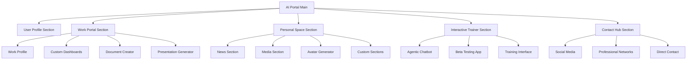

# 🚀 **AI PORTAL INTEGRATION PLAN - Personalized User Portal**

## 🎯 **PROJECT OVERVIEW**
Creating a comprehensive, personalized AI portal that integrates all AI projects into one unified workspace for users. This will serve as both a personal work hub and a template for other users.

---

## 🏗️ **ARCHITECTURE OVERVIEW**



---

## 📱 **SECTION 1: MY PROFILE**

### **Features:**
- Profile picture with hover effects
- Current whereabouts (location, status)
- Professional summary for clients
- Skills showcase
- Experience timeline

### **Integration Sources:**
- Current website's about section
- Enhanced profile management system
- Professional portfolio elements

---

## 🏢 **SECTION 2: HIS PORTAL (WORK HUB)**

### **2a. Work Profile**
- Professional portfolio
- Client testimonials
- Project showcase
- Skills matrix

### **2b. Customizable Dashboards**
- **Server Management**: ServerHub integration
- **AI Project Monitoring**: Current AI_Projects integration
- **Log Monitoring**: Futuristic Log Dashboard integration
- **Custom Sections**: Profession-specific dashboards
  - Doctor: Appointments, patients, research
  - Developer: Code repos, deployments, monitoring
  - Designer: Project status, client feedback, timelines

### **2c. Document Creator**
- PDF generator integration
- Document templates
- Export functionality

### **2d. Presentation Generator**
- Future enhancement
- AI-powered presentation creation

---

## 🌌 **SECTION 3: PERSONAL SPACE**

### **3a. News Section**
- News app integration
- Personalized news feed
- Category filtering

### **3b. Media Section**
- Songs/videos management
- Playlist creation
- Media library

### **3c. Avatar Generator**
- Smart avatar generator integration
- Custom avatar creation
- Style presets

### **3d. Custom Sections**
- User-defined chill zones
- Hobby sections
- Personal projects

---

## 🤖 **SECTION 4: INTERACTIVE TRAINER**

### **Features:**
- Agentic chatbot integration
- Beta testing app integration
- Self-training interface
- Data input forms
- Backend processing

### **Integration Sources:**
- Agentic_Chatbot - autonomous AI assistant system
- Beta testing application
- Training data management

---

## 📞 **SECTION 5: CONTACT HUB**

### **Features:**
- LinkedIn integration
- WhatsApp integration
- Professional networking
- Direct contact forms

---

## 🎨 **UI/UX REQUIREMENTS**

### **Themes:**
1. **Space Theme** (Default)
2. **Ocean Theme**
3. **Forest Theme**
4. **Sky Theme**
5. **Custom Theme Builder**

### **Mobile Compatibility:**
- Responsive design
- Touch-friendly interface
- Mobile-optimized navigation
- Adaptive layouts

### **Advanced UI/UX:**
- Immersive portal experience
- Smooth animations
- Glass morphism effects
- Interactive elements
- Embedded feeling

---

## 🔧 **TECHNICAL INTEGRATION**

### **Frontend Technologies:**
- React.js (from futuristic dashboard)
- Tailwind CSS
- Framer Motion
- Three.js for 3D effects

### **Backend Technologies:**
- Python Flask (from AI Portal)
- Node.js (from current website)
- WebSocket connections
- RESTful APIs

### **Database:**
- User preferences
- Dashboard configurations
- Training data
- Profile information

---

## 📁 **FILE STRUCTURE PLAN**

```
ai-portal/
├── frontend/
│   ├── src/
│   │   ├── components/
│   │   │   ├── Profile/
│   │   │   ├── WorkPortal/
│   │   │   ├── PersonalSpace/
│   │   │   ├── InteractiveTrainer/
│   │   │   └── ContactHub/
│   │   ├── themes/
│   │   ├── utils/
│   │   └── App.js
│   ├── public/
│   └── package.json
├── backend/
│   ├── api/
│   ├── core/
│   ├── integrations/
│   └── app.py
├── integrations/
│   ├── futuristic_dashboard/
│   ├── agentic_chatbot/
│   ├── avatar_generator/
│   ├── news_app/
│   └── server_hub/
└── docs/
```

---

## 🚀 **IMPLEMENTATION PHASES**

### **Phase 1: Core Portal Structure**
- Basic portal layout
- User profile system
- Theme system

### **Phase 2: Work Portal Integration**
- Dashboard framework
- ServerHub integration
- Log dashboard integration

### **Phase 3: AI Services Integration**
- Agentic chatbot
- Avatar generator
- News app

### **Phase 4: Advanced Features**
- Interactive trainer
- Document creator
- Custom dashboards

### **Phase 5: Polish & Testing**
- Mobile optimization
- Performance optimization
- User testing

---

## 🎯 **NEXT STEPS**

1. **Create the basic portal structure**
2. **Integrate existing projects one by one**
3. **Build the theme system**
4. **Implement mobile responsiveness**
5. **Create the training interface**

**Ready to start building this incredible AI portal?**


