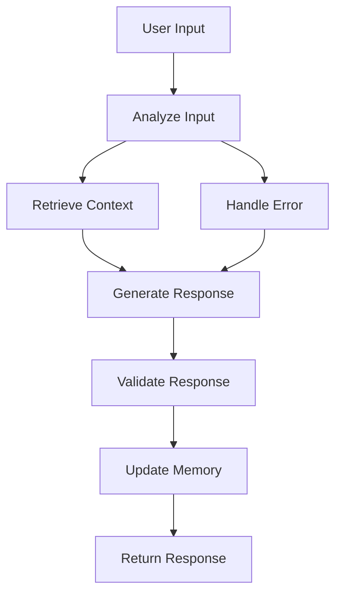

# 🤖 Enhanced Agentic Chatbot - LangGraph Documentation

## 🚀 **Overview**

The **Enhanced Agentic Chatbot** is an autonomous AI assistant system built using **LangGraph** that provides advanced workflow capabilities, stateful conversations, and intelligent multi-agent interactions.

## ✨ **Key Features**

### **🧠 LangGraph Workflows**
- **Multi-step reasoning**: Complex problem-solving workflows
- **Stateful conversations**: Maintains context across interactions
- **Workflow orchestration**: Automated multi-step processes
- **Error handling**: Robust error recovery and fallback mechanisms

### **🔄 Multi-Agent System**
- **Intent analysis**: Automatic intent detection and routing
- **Context retrieval**: Smart context gathering from conversation history
- **Response generation**: AI-powered response creation
- **Memory management**: Persistent conversation memory
- **Validation**: Response quality assurance

### **💾 Persistent Memory**
- **SQLite database**: Conversation history storage
- **User preferences**: Personalized experience
- **Workflow history**: Track multi-step processes
- **Context persistence**: Maintain conversation context

### **🛠️ Tool Integration**
- **OpenAI integration**: GPT models for advanced responses
- **Hugging Face models**: Local model fallback
- **External APIs**: Seamless API integration
- **Custom tools**: Extensible tool system

## 🏗️ **Architecture**

### **LangGraph Workflow**


### **State Management**
```python
class AgenticState(TypedDict):
    messages: List[Dict[str, Any]]
    current_message: str
    user_id: str
    session_id: str
    context: Dict[str, Any]
    user_preferences: Dict[str, Any]
    conversation_history: List[Dict[str, Any]]
    current_task: str
    task_status: str
    workflow_step: int
    ai_response: str
    confidence_score: float
    suggested_actions: List[str]
    tools_used: List[str]
    tool_results: Dict[str, Any]
    error_message: str
    retry_count: int
```

## 📁 **File Structure**

```
enhanced-agentic-chatbot/
├── enhanced-agentic-chatbot-langgraph.py    # Main chatbot server
├── enhanced-agentic-config.py               # Configuration management
├── enhanced-agentic-integration.js          # Frontend integration
├── requirements-enhanced-agentic.txt        # Python dependencies
├── start-enhanced-agentic.sh               # Startup script
├── ENHANCED_AGENTIC_CHATBOT_DOCUMENTATION.md # This documentation
├── data/                                   # Data storage
│   ├── agentic_chatbot.db                 # SQLite database
│   └── agentic_checkpoints.db             # LangGraph checkpoints
└── logs/                                   # Log files
```

## 🚀 **Quick Start**

### **1. Prerequisites**
- Python 3.8 or higher
- pip3
- Node.js (for frontend integration)

### **2. Installation**
```bash
# Clone or download the files
# Navigate to the project directory

# Make startup script executable
chmod +x start-enhanced-agentic.sh

# Run the startup script
./start-enhanced-agentic.sh
```

### **3. Environment Variables (Optional)**
```bash
# OpenAI API Key (for GPT models)
export OPENAI_API_KEY="your-openai-api-key"

# Hugging Face API Key (for HF models)
export HUGGINGFACE_API_KEY="your-hf-api-key"

# Server Configuration
export HOST="localhost"
export PORT="5001"
export DEBUG="False"

# Database Configuration
export DB_PATH="agentic_chatbot.db"
export CHECKPOINT_PATH="agentic_checkpoints.db"
```

### **4. Manual Installation**
```bash
# Install Python dependencies
pip3 install -r requirements-enhanced-agentic.txt

# Run the chatbot
python3 enhanced-agentic-chatbot-langgraph.py
```

## 🔧 **Configuration**

### **Model Configuration**
```python
@dataclass
class ModelConfig:
    openai_model: str = "gpt-3.5-turbo"
    huggingface_model: str = "microsoft/DialoGPT-medium"
    temperature: float = 0.7
    max_tokens: int = 1000
    max_length: int = 200
```

### **Workflow Configuration**
```python
@dataclass
class WorkflowConfig:
    max_iterations: int = 10
    timeout_seconds: int = 30
    enable_memory: bool = True
    enable_tools: bool = True
    enable_feedback_loops: bool = True
    checkpoint_enabled: bool = True
    state_persistence: bool = True
```

### **API Configuration**
```python
@dataclass
class APIConfig:
    host: str = "localhost"
    port: int = 5001
    debug: bool = False
    cors_origins: List[str] = ["*"]
    rate_limit_enabled: bool = True
```

## 📡 **API Endpoints**

### **Chat Endpoint**
```http
POST /chat
Content-Type: application/json

{
    "message": "Hello, how can you help me?",
    "session_id": "session_123",
    "user_id": "user_456",
    "context": {
        "user_type": "portfolio_visitor",
        "source": "website_chatbot"
    }
}
```

**Response:**
```json
{
    "response": "Hello! I'm your Enhanced Agentic AI Assistant...",
    "session_id": "session_123",
    "confidence_score": 0.85,
    "suggested_actions": ["Tell me about your portfolio", "What AI projects have you worked on?"],
    "workflow_status": "completed",
    "metadata": {
        "intent": "greeting",
        "workflow_step": 5,
        "tools_used": ["intent_analysis", "response_generation"]
    }
}
```

### **Status Endpoint**
```http
GET /status
```

**Response:**
```json
{
    "status": "healthy",
    "service": "Enhanced Agentic Chatbot (LangGraph)",
    "features": [
        "LangGraph Workflows",
        "Stateful Conversations",
        "Multi-Agent System",
        "Persistent Memory",
        "Error Handling",
        "Tool Integration"
    ],
    "models": {
        "primary": "gpt-3.5-turbo",
        "fallback": "microsoft/DialoGPT-medium"
    }
}
```

### **Tools Endpoint**
```http
GET /tools
```

**Response:**
```json
{
    "tools": [
        "Intent Analysis",
        "Context Retrieval",
        "Response Generation",
        "Memory Management",
        "Error Handling",
        "Workflow Orchestration"
    ],
    "capabilities": [
        "Multi-step reasoning",
        "Stateful conversations",
        "Persistent memory",
        "Autonomous decision making",
        "Human-in-the-loop feedback"
    ]
}
```

### **Session Endpoint**
```http
GET /session/{session_id}
```

**Response:**
```json
{
    "session_id": "session_123",
    "conversations": [
        {
            "message": "Hello",
            "response": "Hello! How can I help you?",
            "timestamp": "2024-01-01T12:00:00Z"
        }
    ]
}
```

## 🎨 **Frontend Integration**

### **Basic Integration**
```html
<!DOCTYPE html>
<html>
<head>
    <title>Enhanced Agentic Chatbot</title>
</head>
<body>
    <!-- Include the enhanced integration script -->
    <script src="enhanced-agentic-integration.js"></script>
    
    <!-- Initialize the chatbot -->
    <script>
        const chatbot = new EnhancedAgenticChatbotWidget({
            ui: {
                showWorkflowSteps: true,
                showConfidenceScore: true,
                showSuggestedActions: true
            }
        });
    </script>
</body>
</html>
```

### **Advanced Configuration**
```javascript
const chatbot = new EnhancedAgenticChatbotWidget({
    // API Configuration
    primary: {
        baseURL: 'http://localhost:5001',
        timeout: 30000
    },
    
    // UI Configuration
    ui: {
        theme: 'dark',
        primaryColor: '#00ffee',
        showWorkflowSteps: true,
        showConfidenceScore: true,
        showSuggestedActions: true
    },
    
    // LangGraph Features
    langgraph: {
        enableWorkflows: true,
        showWorkflowSteps: true,
        enableStatePersistence: true,
        enableMultiAgent: true,
        enableFeedbackLoops: true
    }
});
```

## 🔄 **Workflow Examples**

### **1. Greeting Workflow**
```
User: "Hello"
↓
Step 1: Analyze Input (Intent: greeting)
Step 2: Retrieve Context (User preferences, history)
Step 3: Generate Response (Personalized greeting)
Step 4: Validate Response (Quality check)
Step 5: Update Memory (Store interaction)
↓
Response: "Hello! I'm your Enhanced Agentic AI Assistant..."
```

### **2. Portfolio Inquiry Workflow**
```
User: "Tell me about your portfolio"
↓
Step 1: Analyze Input (Intent: portfolio_inquiry)
Step 2: Retrieve Context (Portfolio data, user interests)
Step 3: Generate Response (Detailed portfolio overview)
Step 4: Validate Response (Accuracy check)
Step 5: Update Memory (Store portfolio discussion)
↓
Response: "I'd be happy to tell you about my portfolio..."
```

### **3. Complex Query Workflow**
```
User: "Help me understand AI and how it relates to your work"
↓
Step 1: Analyze Input (Intent: ai_inquiry + help_request)
Step 2: Retrieve Context (AI knowledge, work experience)
Step 3: Generate Response (Comprehensive AI explanation)
Step 4: Validate Response (Technical accuracy)
Step 5: Update Memory (Store AI discussion)
↓
Response: "AI is fascinating! Let me explain how it works..."
```

## 🛠️ **Customization**

### **Adding Custom Tools**
```python
def custom_tool_node(state: AgenticState) -> AgenticState:
    """Custom tool for specific functionality"""
    try:
        # Your custom logic here
        result = perform_custom_operation(state["current_message"])
        
        state["tool_results"]["custom_tool"] = result
        state["tools_used"].append("custom_tool")
        
        return state
    except Exception as e:
        state["error_message"] = str(e)
        return state

# Add to workflow
workflow.add_node("custom_tool", custom_tool_node)
```

### **Custom Intent Analysis**
```python
def custom_intent_analysis(message: str) -> str:
    """Custom intent analysis logic"""
    message_lower = message.lower()
    
    # Your custom intent detection
    if "custom_keyword" in message_lower:
        return "custom_intent"
    
    # Fallback to default
    return "general_inquiry"
```

### **Custom Response Generation**
```python
async def custom_response_generation(prompt: str) -> str:
    """Custom response generation"""
    # Your custom AI model or logic
    response = your_custom_ai_model.generate(prompt)
    return response
```

## 📊 **Monitoring and Analytics**

### **Database Schema**
```sql
-- Conversations table
CREATE TABLE conversations (
    id INTEGER PRIMARY KEY AUTOINCREMENT,
    session_id TEXT NOT NULL,
    user_id TEXT NOT NULL,
    message TEXT NOT NULL,
    response TEXT NOT NULL,
    timestamp DATETIME DEFAULT CURRENT_TIMESTAMP,
    context TEXT,
    metadata TEXT
);

-- User preferences table
CREATE TABLE user_preferences (
    id INTEGER PRIMARY KEY AUTOINCREMENT,
    user_id TEXT UNIQUE NOT NULL,
    preferences TEXT NOT NULL,
    updated_at DATETIME DEFAULT CURRENT_TIMESTAMP
);

-- Workflow history table
CREATE TABLE workflow_history (
    id INTEGER PRIMARY KEY AUTOINCREMENT,
    session_id TEXT NOT NULL,
    workflow_type TEXT NOT NULL,
    steps_completed INTEGER,
    status TEXT,
    metadata TEXT,
    timestamp DATETIME DEFAULT CURRENT_TIMESTAMP
);
```

### **Logging**
```python
import logging

# Configure logging
logging.basicConfig(
    level=logging.INFO,
    format='%(asctime)s - %(name)s - %(levelname)s - %(message)s',
    handlers=[
        logging.FileHandler('logs/agentic_chatbot.log'),
        logging.StreamHandler()
    ]
)
```

## 🔒 **Security**

### **Input Validation**
```python
def validate_input(message: str) -> bool:
    """Validate user input"""
    if len(message) > 1000:
        return False
    
    # Check for blocked keywords
    blocked_keywords = ["spam", "scam", "phishing"]
    if any(keyword in message.lower() for keyword in blocked_keywords):
        return False
    
    return True
```

### **Rate Limiting**
```python
from flask_limiter import Limiter
from flask_limiter.util import get_remote_address

limiter = Limiter(
    app,
    key_func=get_remote_address,
    default_limits=["100 per hour"]
)

@app.route('/chat', methods=['POST'])
@limiter.limit("10 per minute")
def chat():
    # Chat endpoint with rate limiting
    pass
```

## 🚨 **Troubleshooting**

### **Common Issues**

#### **1. Port Already in Use**
```bash
# Check what's using the port
lsof -i :5001

# Kill the process
kill -9 <PID>

# Or use a different port
export PORT=5002
```

#### **2. Missing Dependencies**
```bash
# Install missing dependencies
pip3 install langgraph langchain transformers torch flask

# Or reinstall all dependencies
pip3 install -r requirements-enhanced-agentic.txt
```

#### **3. Database Issues**
```bash
# Remove corrupted database
rm agentic_chatbot.db agentic_checkpoints.db

# Restart the chatbot (will recreate databases)
python3 enhanced-agentic-chatbot-langgraph.py
```

#### **4. Model Loading Issues**
```bash
# Check if models are available
python3 -c "from transformers import pipeline; print('Models OK')"

# Clear model cache
rm -rf ~/.cache/huggingface/
```

### **Debug Mode**
```bash
# Enable debug mode
export DEBUG=True

# Run with verbose logging
python3 enhanced-agentic-chatbot-langgraph.py
```

## 📈 **Performance Optimization**

### **Database Optimization**
```python
# Enable WAL mode for better concurrency
cursor.execute("PRAGMA journal_mode=WAL")

# Optimize for performance
cursor.execute("PRAGMA synchronous=NORMAL")
cursor.execute("PRAGMA cache_size=10000")
cursor.execute("PRAGMA temp_store=MEMORY")
```

### **Model Optimization**
```python
# Use smaller models for faster inference
config = ModelConfig(
    huggingface_model="microsoft/DialoGPT-small",  # Smaller model
    max_length=100,  # Shorter responses
    temperature=0.5  # More focused responses
)
```

### **Caching**
```python
from functools import lru_cache

@lru_cache(maxsize=1000)
def cached_intent_analysis(message: str) -> str:
    """Cached intent analysis"""
    return analyze_intent(message)
```

## 🔮 **Future Enhancements**

### **Planned Features**
- **Multi-modal support**: Image and audio processing
- **Advanced NLP**: Sentiment analysis, entity recognition
- **Custom model training**: Fine-tuned models for specific use cases
- **Real-time collaboration**: Multiple users in same session
- **Advanced analytics**: Conversation insights and metrics
- **Plugin system**: Extensible tool architecture

### **Integration Opportunities**
- **Slack/Discord bots**: Team communication integration
- **CRM systems**: Customer relationship management
- **Knowledge bases**: Document search and retrieval
- **Calendar systems**: Meeting scheduling and management
- **Email systems**: Automated email responses

## 📚 **Resources**

### **Documentation**
- [LangGraph Documentation](https://langchain-ai.github.io/langgraph/)
- [LangChain Documentation](https://python.langchain.com/)
- [Hugging Face Transformers](https://huggingface.co/docs/transformers/)
- [Flask Documentation](https://flask.palletsprojects.com/)

### **Models**
- [OpenAI Models](https://platform.openai.com/docs/models)
- [Hugging Face Models](https://huggingface.co/models)
- [DialoGPT Models](https://huggingface.co/microsoft/DialoGPT-medium)

### **Tools**
- [LangGraph Studio](https://langchain-ai.github.io/langgraph/)
- [Hugging Face Spaces](https://huggingface.co/spaces)
- [OpenAI Playground](https://platform.openai.com/playground)

## 🤝 **Contributing**

### **Development Setup**
```bash
# Clone the repository
git clone <repository-url>

# Install development dependencies
pip3 install -r requirements-enhanced-agentic.txt
pip3 install pytest black flake8

# Run tests
pytest tests/

# Format code
black enhanced-agentic-chatbot-langgraph.py

# Lint code
flake8 enhanced-agentic-chatbot-langgraph.py
```

### **Contributing Guidelines**
1. Fork the repository
2. Create a feature branch
3. Make your changes
4. Add tests for new functionality
5. Ensure all tests pass
6. Submit a pull request

## 📄 **License**

This project is licensed under the MIT License. See the LICENSE file for details.

## 📞 **Support**

For support and questions:
- Create an issue in the repository
- Contact the development team
- Check the troubleshooting section
- Review the documentation

---

**🚀 Enhanced Agentic Chatbot - Powered by LangGraph**

*Building the future of autonomous AI assistants*
