```mermaid
graph TB
    A[Existing AI Portal] --> B[Enhanced Profile Section]
    A --> C[Enhanced Work Portal]
    A --> D[Enhanced Personal Space]
    A --> E[Enhanced Interactive Trainer]
    A --> F[Enhanced Contact Hub]
    A --> G[Theme System]
    
    B --> B1[Professional Profile]
    B --> B2[Current Status]
    B --> B3[Skills Showcase]
    
    C --> C1[Work Profile]
    C --> C2[Custom Dashboards]
    C --> C3[Document Creator]
    C --> C4[Server Management]
    
    D --> D1[News Integration]
    D --> D2[Media Management]
    D --> D3[Avatar Generator]
    D --> D4[Custom Sections]
    
    E --> E1[Agentic Chatbot]
    E --> E2[Training Interface]
    E --> E3[Data Management]
    
    F --> F1[Social Media]
    F --> F2[Professional Networks]
    F --> F3[Direct Contact]
    
    G --> G1[Space Theme]
    G --> G2[Ocean Theme]
    G --> G3[Forest Theme]
    G --> G4[Sky Theme]
    G --> G5[Custom Builder]
```

# 🚀 **ENHANCED AI PORTAL PLAN - Building on Existing Foundation**

## 🎯 **CURRENT STATUS ANALYSIS**
✅ **Already Built:**
- Flask backend with avatar engine
- AI assistant system
- Basic HTML template with Tailwind CSS
- Portal system and social networking
- Avatar creation capabilities

🔄 **Needs Enhancement:**
- Personal profile section
- Work portal with customizable dashboards
- Personal space integration
- Interactive trainer section
- Contact hub
- Theme system (Space, Ocean, Forest, Sky)
- Mobile responsiveness

---

## 🏗️ **ENHANCEMENT ARCHITECTURE**



---

## 📱 **SECTION 1: ENHANCED PROFILE SECTION**

### **Current State:** Basic profile display
### **Enhancement Plan:**
- **Profile Picture**: Enhanced DP with hover effects
- **Current Status**: Real-time whereabouts and status
- **Professional Summary**: Client-focused information
- **Skills Matrix**: Interactive skills showcase
- **Experience Timeline**: Professional journey display

### **Integration Points:**
- Enhance existing `portal_system` module
- Add real-time status updates
- Integrate with existing avatar system

---

## 🏢 **SECTION 2: ENHANCED WORK PORTAL**

### **Current State:** Basic portal functionality
### **Enhancement Plan:**

#### **2a. Work Profile**
- Professional portfolio showcase
- Client testimonials
- Project highlights
- Skills demonstration

#### **2b. Customizable Dashboards**
- **Server Management**: Integrate with existing ServerHub
- **AI Project Monitoring**: Connect with current AI_Projects
- **Log Monitoring**: Integrate Futuristic Log Dashboard
- **Custom Sections**: Profession-specific dashboards
  - Developer: Code repos, deployments, monitoring
  - Designer: Project status, client feedback
  - Doctor: Appointments, patients, research

#### **2c. Document Creator**
- PDF generator integration
- Document templates
- Export functionality

#### **2d. Presentation Generator**
- Future enhancement placeholder
- AI-powered presentation creation

---

## 🌌 **SECTION 3: ENHANCED PERSONAL SPACE**

### **Current State:** Basic personal features
### **Enhancement Plan:**

#### **3a. News Section**
- Integrate existing news app
- Personalized news feed
- Category filtering

#### **3b. Media Section**
- Songs/videos management
- Playlist creation
- Media library

#### **3c. Avatar Generator**
- **Already Built!** ✅ Enhance existing avatar engine
- Custom avatar creation
- Style presets
- Integration with personal space

#### **3d. Custom Sections**
- User-defined chill zones
- Hobby sections
- Personal projects

---

## 🤖 **SECTION 4: ENHANCED INTERACTIVE TRAINER**

### **Current State:** Basic AI assistant
### **Enhancement Plan:**

#### **4a. Agentic Chatbot Integration**
- Connect with existing Agentic_Chatbot system
- Enhanced training capabilities
- Self-learning interface

#### **4b. Beta Testing App Integration**
- Integrate existing beta testing functionality
- Enhanced data input forms
- Training data management

#### **4c. Training Interface**
- Interactive training dashboard
- Data visualization
- Progress tracking

---

## 📞 **SECTION 5: ENHANCED CONTACT HUB**

### **Current State:** Basic contact system
### **Enhancement Plan:**
- LinkedIn integration
- WhatsApp integration
- Professional networking
- Direct contact forms

---

## 🎨 **THEME SYSTEM IMPLEMENTATION**

### **Current State:** Basic styling
### **Enhancement Plan:**

#### **Mandatory Themes:**
1. **Space Theme** (Default) - Enhance existing space aesthetic
2. **Ocean Theme** - Blue-green gradients, wave animations
3. **Forest Theme** - Green-brown gradients, nature elements
4. **Sky Theme** - Blue-white gradients, cloud animations

#### **Custom Theme Builder:**
- Color palette customization
- Animation preferences
- Layout customization
- User preference storage

---

## 🔧 **TECHNICAL IMPLEMENTATION STRATEGY**

### **Phase 1: Core Enhancements (Week 1)**
- Enhance existing profile system
- Improve work portal functionality
- Add theme switching capability

### **Phase 2: Dashboard Integration (Week 2)**
- Integrate ServerHub
- Connect Futuristic Log Dashboard
- Add custom dashboard framework

### **Phase 3: AI Services (Week 3)**
- Enhance avatar generator
- Integrate Agentic chatbot
- Add news app integration

### **Phase 4: Polish & Mobile (Week 4)**
- Mobile responsiveness
- Performance optimization
- User testing

---

## 📁 **ENHANCED FILE STRUCTURE**

```
AI_Portal - AI project management portal/
├── app.py                          # ✅ Enhanced Flask app
├── config.py                       # ✅ Configuration
├── requirements.txt                # ✅ Dependencies
├── 
├── core/                           # ✅ Enhanced core modules
│   ├── avatar_engine/             # ✅ Enhanced avatar system
│   ├── ai_assistant/              # ✅ Enhanced AI assistant
│   ├── portal_system/             # 🔄 Enhanced portal system
│   ├── social_network/            # 🔄 Enhanced social features
│   ├── dashboard_manager/         # 🆕 New dashboard system
│   ├── theme_manager/             # 🆕 Theme management
│   └── integration_manager/       # 🆕 External integrations
├── 
├── templates/                      # 🔄 Enhanced templates
│   ├── index.html                 # 🔄 Enhanced main portal
│   ├── profile.html               # 🆕 Profile section
│   ├── work_portal.html           # 🆕 Work hub
│   ├── personal_space.html        # 🆕 Personal space
│   ├── trainer.html               # 🆕 Interactive trainer
│   └── contact.html               # 🆕 Contact hub
├── 
├── static/                         # 🔄 Enhanced static assets
│   ├── css/                       # 🔄 Enhanced styles
│   ├── js/                        # 🔄 Enhanced JavaScript
│   ├── themes/                    # 🆕 Theme assets
│   └── images/                    # 🔄 Enhanced images
├── 
├── integrations/                   # 🆕 External integrations
│   ├── futuristic_dashboard/      # Log dashboard integration
│   ├── agentic_chatbot/          # Chatbot integration
│   ├── server_hub/               # Server management
│   └── news_app/                 # News integration
└── 
└── docs/                          # 📚 Enhanced documentation
```

---

## 🚀 **IMMEDIATE NEXT STEPS**

1. **Enhance existing profile system** in `portal_system`
2. **Add theme switching capability** to existing template
3. **Enhance work portal** with dashboard framework
4. **Integrate existing avatar engine** with personal space
5. **Add mobile responsiveness** to existing template

**Ready to start enhancing your existing AI Portal?**


