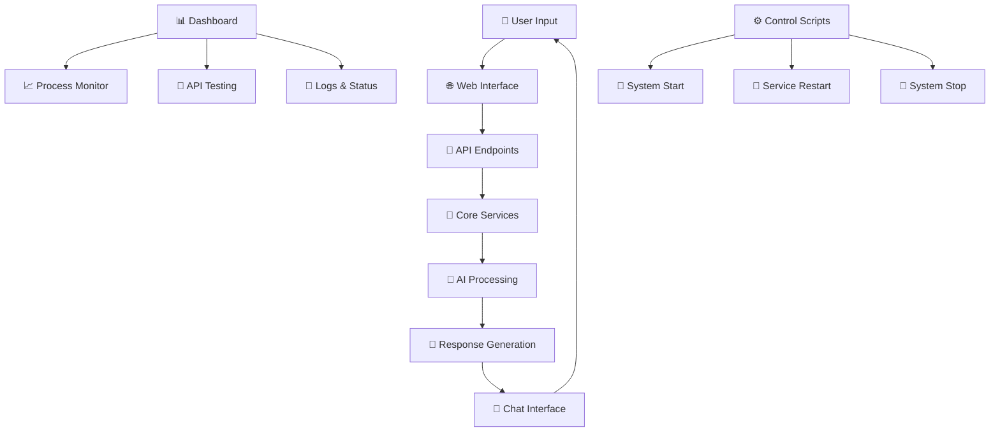

# 🏗️ **CHATBOT PROJECT ARCHITECTURE**

## 🎯 **SYSTEM OVERVIEW**

```
┌─────────────────────────────────────────────────────────────────────────────┐
│                        🚀 AI-POWERED CHATBOT SYSTEM                        │
├─────────────────────────────────────────────────────────────────────────────┤
│  Frontend (Port 4000)  │  Dashboard (Port 8000)  │  Backend (Port 8001)   │
│                         │                         │                         │
│  🌐 Website            │  📊 Monitoring          │  🤖 AI Processing      │
│  💬 Chat Interface     │  🔍 Process Monitor    │  🧠 Gemini API         │
│  🎨 Portfolio          │  🧪 API Testing         │  📡 WebSocket          │
└─────────────────────────────────────────────────────────────────────────────┘
```

---

## 🔄 **SERVICE FLOW DIAGRAM**



---

## 🗂️ **FILE ORGANIZATION STRUCTURE**

```
📁 Chatbot Project
├── 🚀 scripts/                    # System Control
│   ├── run_with_logs.sh          # MAIN ENTRY POINT
│   ├── status.sh                 # Status Check
│   ├── restart.sh                # Service Restart
│   └── stop.sh                   # System Stop
│
├── 🌐 api/endpoints/             # Web Services
│   ├── app_runner_enhanced.py    # MAIN FLASK SERVER
│   ├── web_chat_interface.py     # Web UI
│   └── test_backend.py           # Testing
│
├── ⚙️ core/                      # Core System
│   ├── config/                   # Configuration
│   ├── models/                   # Data Models
│   ├── services/                 # Business Logic
│   └── utils/                    # Utilities
│
├── 🎨 Website/                   # Frontend
│   ├── index.html                # Main Page
│   ├── astronaut_chatbot_integration.js
│   └── assets/                   # Images & CSS
│
└── 📊 Dashboard/                 # Monitoring
    └── chatbot-dashboard.js      # Port 8000
```

---

## 🌐 **PORT ARCHITECTURE**

| Port | Service | Purpose | Status |
|-------|---------|---------|---------|
| **4000** | 🌐 **Main Website** | Portfolio + Chatbot | ✅ Running |
| **8000** | 📊 **Dashboard** | Testing + Monitoring | ✅ Running |
| **8001** | 🤖 **AI Assistant** | WebSocket + Real-time | ❌ Disabled |
| **8080** | 🧪 **Simple Server** | Alternative HTTP | ❌ Disabled |

---

## 🔧 **COMPONENT INTERACTIONS**

### **1. User Interaction Flow**
```
User → Website (4000) → Chatbot JS → Dashboard API (8000) → Backend Services
```

### **2. Monitoring Flow**
```
Dashboard (8000) → Process Monitor → System Stats → Real-time Updates
```

### **3. Development Flow**
```
Code Changes → Scripts → Service Restart → Testing → Monitoring
```

---

## 🎯 **KEY COMPONENTS EXPLAINED**

### **🚀 Startup Scripts**
- **Purpose:** System automation and control
- **Location:** `scripts/` directory
- **Function:** Start, stop, restart, monitor services

### **🌐 API Endpoints**
- **Purpose:** Web service interfaces
- **Location:** `api/endpoints/` directory
- **Function:** Handle HTTP requests and responses

### **⚙️ Core System**
- **Purpose:** Business logic and utilities
- **Location:** `core/` directory
- **Function:** Process data, manage AI, handle business rules

### **📊 Dashboard**
- **Purpose:** Testing and monitoring
- **Location:** Port 8000
- **Function:** Real-time system monitoring and testing

---

## 🔍 **MONITORING & DEBUGGING**

### **Real-time Monitoring**
- **Process Status:** Active processes and resource usage
- **API Health:** Endpoint availability and response times
- **System Metrics:** CPU, Memory, Network usage
- **Log Management:** Centralized logging and error tracking

### **Testing Tools**
- **Chat Testing:** Interactive chat interface
- **API Testing:** Individual endpoint testing
- **Process Monitoring:** Backend process health
- **Performance Metrics:** Response times and throughput

---

## 🚀 **DEPLOYMENT ARCHITECTURE**

```
Development → Testing → Staging → Production
     ↓           ↓        ↓         ↓
   Local      Dashboard  Test      Live
   Port 4000  Port 8000  Port 8001 Port 80
```

---

## 📈 **SCALABILITY FEATURES**

- **Modular Design:** Independent service components
- **Port Separation:** Isolated service ports
- **Load Balancing:** Multiple server instances
- **Monitoring:** Real-time performance tracking
- **Automation:** Script-based service management

---

*This architecture provides a scalable, maintainable, and well-organized chatbot system with clear separation of concerns and comprehensive monitoring capabilities.* 🚀

